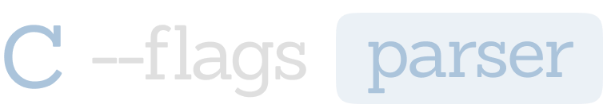

<p align="center">
    
</p>

<p align="center">
    
    
    
        
    
</p>

Library for parsing command line arguments easily. Like golang `flag` module.

>👍 Supports [single header](single-header/c-flags.h) version

# Usage

```c
#include <c-flags.h>
#include <inttypes.h>
#include <stdio.h>

int main(int argc, char *argv[])
{
    if (argc > 0)
        c_flags_set_application_name(argv[0]);

    c_flags_set_positional_args_description("<file-path>");
    c_flags_set_description("A program to demonstrate the capabilities of the c-flags library");

    bool *verbose = c_flag_bool("verbose", "v", "verbose mode", false);
    uint64_t *batch = c_flag_uint64("batch-size", "bs", "declare batch size", 32);
    size_t *offset = c_flag_size_t("offset", "off", "declare file offset", 0);
    bool *help = c_flag_bool("help", "h", "show usage", false);

    c_flags_parse(&argc, &argv, false);

    if (*help) {
        c_flags_usage();
        return 0;
    }

    if (argc == 0) {
        printf("ERROR: required file path not specified\n\n");
        c_flags_usage();
        return 1;
    }

    char *file_path = argv[0];

    printf("Parsed command line arguments and flags:\n");
    printf("   verbose:    %s\n", *verbose ? "true" : "false");
    printf("   batch-size: %" PRIu64 "\n", *batch);
    printf("   offset:     %zu\n", *offset);
    printf("   file-path:  %s\n", file_path);

    return 0;
}
```

```
USAGE:
   builddir/examples/example [OPTIONS] <file-path>

DESCRIPTION:
   A program to demonstrate the capabilities of the c-flags library

OPTIONS:
   --verbose, -v
       Description: verbose mode
       Default: false

   --batch-size, -bs
       Description: declare batch size
       Default: 32

   --offset, -off
       Description: declare file offset
       Default: 0

   --help, -h
       Description: show usage
       Default: true
```

# Install

```bash
$ meson builddir && cd builddir
$ meson compile
$ sudo meson install
```

# Linking

The library supports `pkg-config`, which makes linking easier and more convenient.

```cmake
cmake_minimum_required(VERSION 3.14)
project(program)

find_package(PkgConfig)
pkg_search_module(C_FLAGS REQUIRED c-flags)

add_executable(program examples/example.c)

target_compile_options(program PUBLIC ${C_FLAGS_CFLAGS})
target_link_libraries(program PUBLIC ${C_FLAGS_LIBRARIES})
```

# License

Copyright (c) 2023 Denis Glazkov glazzk.off@mail.ru

Permission is hereby granted, free of charge, to any person obtaining a copy
of this software and associated documentation files (the "Software"), to deal
in the Software without restriction, including without limitation the rights
to use, copy, modify, merge, publish, distribute, sublicense, and/or sell
copies of the Software, and to permit persons to whom the Software is
furnished to do so, subject to the following conditions:

The above copyright notice and this permission notice shall be included in all
copies or substantial portions of the Software.

THE SOFTWARE IS PROVIDED "AS IS", WITHOUT WARRANTY OF ANY KIND, EXPRESS OR
IMPLIED, INCLUDING BUT NOT LIMITED TO THE WARRANTIES OF MERCHANTABILITY,
FITNESS FOR A PARTICULAR PURPOSE AND NONINFRINGEMENT. IN NO EVENT SHALL THE
AUTHORS OR COPYRIGHT HOLDERS BE LIABLE FOR ANY CLAIM, DAMAGES OR OTHER
LIABILITY, WHETHER IN AN ACTION OF CONTRACT, TORT OR OTHERWISE, ARISING FROM,
OUT OF OR IN CONNECTION WITH THE SOFTWARE OR THE USE OR OTHER DEALINGS IN THE
SOFTWARE.
